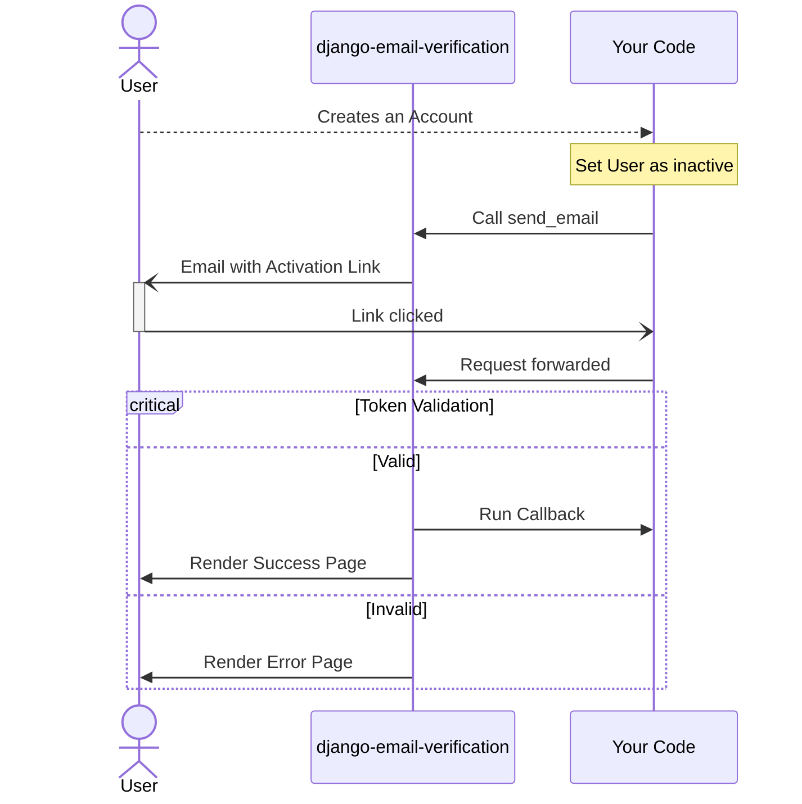
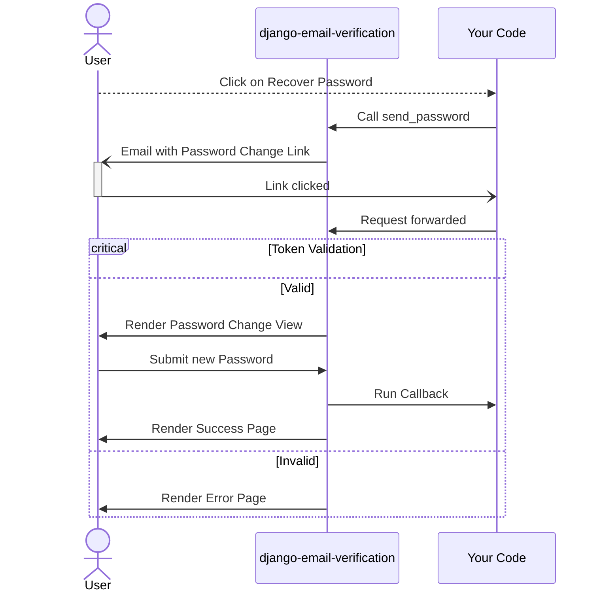

# Django Email Verification

[](https://pypi.org/project/django-email-verification/)
[](https://github.com/LeoneBacciu/django-email-verification/blob/version-0.1.0/LICENSE)
[](https://github.com/LeoneBacciu/django-email-verification/actions)
[](https://codecov.io/gh/LeoneBacciu/django-email-verification)

<p align="center">
  
</p>

<p align="center">
Do you like my work and want to support me?<br/><br/>
<a href="https://www.buymeacoffee.com/LeoneBacciu" target="_blank"></a>
</p>

> ## 🚧 Work in progress 🚧
> The package now also provides all the feature needed for **password recovery**, but the documentation is not ready
> yet. \
> Thanks for your patience!

## Requirements

+ Python >= 3.8
+ Django >= 4.2

## General concept

Here is a simple Sequence Diagram of the email verification process:



And here is a simple Sequence Diagram of the password recovery process:



The app is build to be as little opinionated as possible, every action it can perform can be replaced by custom code,
and everything else will continue working just the same.\
For both Email Verification and Password Recovery, the features can be divided into:

1. [Email Sending](#email-sending)
2. [Verification / Recovery View](#verification--recovery-view)
3. [Verification / Recovery Action](#verification--recovery-action)

## Installation

You can install by:

```commandline
pip3 install django-email-verification
```

and import by:

```python
INSTALLED_APPS = [
    'django.contrib.admin',
    'django.contrib.auth',
    ...
    'django_email_verification',  # you have to add this
]
```

## Settings parameters

You have to add these parameters to the settings, you have to include all of them except the last one:

```python
def email_verified_callback(user):
    user.is_active = True


def password_change_callback(user, password):
    user.set_password(password)


# Global Package Settings
EMAIL_FROM_ADDRESS = 'noreply@aliasaddress.com'  # mandatory
EMAIL_PAGE_DOMAIN = 'https://mydomain.com/'  # mandatory (unless you use a custom link)
EMAIL_MULTI_USER = False  # optional (defaults to False)

# Email Verification Settings (mandatory for email sending)
EMAIL_MAIL_SUBJECT = 'Confirm your email {{ user.username }}'
EMAIL_MAIL_HTML = 'mail_body.html'
EMAIL_MAIL_PLAIN = 'mail_body.txt'
EMAIL_MAIL_TOKEN_LIFE = 60 * 60  # one hour

# Email Verification Settings (mandatory for builtin view)
EMAIL_MAIL_PAGE_TEMPLATE = 'email_success_template.html'
EMAIL_MAIL_CALLBACK = email_verified_callback

# Password Recovery Settings (mandatory for email sending)
EMAIL_PASSWORD_SUBJECT = 'Change your password {{ user.username }}'
EMAIL_PASSWORD_HTML = 'password_body.html'
EMAIL_PASSWORD_PLAIN = 'password_body.txt'
EMAIL_PASSWORD_TOKEN_LIFE = 60 * 10  # 10 minutes

# Password Recovery Settings (mandatory for builtin view)
EMAIL_PASSWORD_PAGE_TEMPLATE = 'password_changed_template.html'
EMAIL_PASSWORD_CHANGE_PAGE_TEMPLATE = 'password_change_template.html'
EMAIL_PASSWORD_CALLBACK = password_change_callback

# For Django Email Backend
EMAIL_BACKEND = 'django.core.mail.backends.console.EmailBackend'
EMAIL_HOST = 'smtp.gmail.com'
EMAIL_PORT = 587
EMAIL_HOST_USER = 'mymail@gmail.com'
EMAIL_HOST_PASSWORD = 'mYC00lP4ssw0rd'  # os.environ['password_key'] suggested
EMAIL_USE_TLS = True


```

For simplicity, I will refer to both `XX_MAIL_XX` and `XX_PASSWORD_XX` by writing `XX_{MAIL|PASSWORD}_XX`.

In detail:

+ `EMAIL_FROM_ADDRESS`: this can be the same as `EMAIL_HOST_USER` or an alias address if required.
+ `EMAIL_PAGE_DOMAIN`: the domain of the confirmation link (usually your site's domain).
+ `EMAIL_MULTI_USER`: (optional) if `True` an error won't be thrown if multiple users with the same email are present (
  just one will be activated)
+ `EMAIL_MAIL_CALLBACK`: will be called when the user successfully verifies the email. Can be a function (taking the
  user object as a parameter) or a method on the user object (no arguments) [^1].
+ `EMAIL_PASSWORD_CALLBACK`: will be called when the user successfully submits a new password. Can be a function (taking the
  user object and the new password as parameters) or a method on the user object (taking the new password as a parameter)[^1].
+ `EMAIL_{MAIL|PASSWORD}_`: are all django templates:
    * `SUBJECT`: the mail default subject.
    * `HTML`: the mail body template in form of html.
    * `PLAIN`: the mail body template in form of .txt file.
+ `EMAIL_{MAIL|PASSWORD}_TOKEN_LIFE`: the lifespan of the email link (in seconds).
+ `EMAIL_{MAIL|PASSWORD}_PAGE_TEMPLATE`: the template of the success/error view. Takes `{success: bool, user: Model, request: WSGIRequest}` as parameters.
+ `EMAIL_PASSWORD_CHANGE_TEMPLATE`: the template for the page with the form to submit a new password. Must send a POST request to the same address, with the field `password` in the payload.

For the Django Email Backend fields look at the
official [documentation](https://docs.djangoproject.com/en/4.2/topics/email/).


## Email Sending

The functions in charge of sending the emails are the following:

```python
send_email(user, thread=True, expiry=None, context=None)
send_password(user, thread=True, expiry=None, context=None)
```

The fields are:
 - `user` (`Model`): the user you want to send the email to
 - `thread` (`bool`): whether to send the email asynchronously or not
 - `expiry` (`datetime`): custom token expiry date (different from `datetime.now() + EMAIL_{MAIL|PASSWORD}_TOKEN_LIFE`)
 - `context` (`dict`): additional context for the email template

> **NOTE**: By default the email is sent asynchronously, which is the suggested behaviour, if this is a problem (for
> example if you are running synchronous tests), you can pass the parameter `thread=False`.

```python
from django.shortcuts import render
from django.contrib.auth import get_user_model
from django_email_verification import send_email


def create_account_functional_view(request):
    ...
    user = get_user_model().objects.create(username=username, password=password, email=email)
    user.is_active = False  # Example
    send_email(user)
    return render(...)


def recover_password_functional_view(request):
    ...
    send_password(user)
    return render(...)
```

`send_email(user)` and `send_password(user)` send an email with the defined template (and the pseudo-random generated token) to the user.

> **_IMPORTANT:_** For email verification, you have to manually set the user to inactive before sending the email.

If you are using class based views, then it is necessary to call the superclass before calling the `send_email`
method.

```python
from django.views.generic.edit import FormView
from django_email_verification import send_email


class CreateAccountClassView(FormView):

    def form_valid(self, form):
        user = form.save()
        return_val = super(CreateAccountClassView, self).form_valid(form)
        send_email(user)
        return return_val
```


### Templates examples

The `EMAIL_{MAIL|PASSWORD}_SUBJECT` is a template that receives `{{ link }}`(`str`), `{{ expiry }}`(`datetime`) and `user`(`Model`) (plus your custom context) as arguments,
it might look something like this:

```python
EMAIL_MAIL_SUBJECT = 'Confirm your email {{ user.username }}'
EMAIL_PASSWORD_SUBJECT = 'Change password request for {{ user.username }}'
```

The `EMAIL_{MAIL|PASSWORD}_HTML` is a template that receives `{{ link }}`(`str`), `{{ expiry }}`(`datetime`) and `user`(`Model`) (plus your custom contex) as arguments,
it might look something like this:

```html
<h1>You are almost there, {{ user.username }}!</h1><br>
<h2>Please click <a href="{{ link }}">here</a> to confirm your account</h2>
<h2>The token expires on {{ expiry|time:"TIME_FORMAT" }}</h2>
```

The `EMAIL_{MAIL|PASSWORD}_PLAIN` is a template that receives `{{ link }}`(`str`), `{{ expiry }}`(`datetime`) and `user`(`Model`) (plus your custom contex) as arguments,
it might look something like this:

```text
You are almost there, {{ user.username }}!
Please click the following link to confirm your account: {{ link }}
The token expires on {{ expiry|time:"TIME_FORMAT" }}
```

## Verification / Recovery View

The easiest way to recieve the token is to use the builtin views.
To do so you just need to include the application's urls and define the necessary Django templates.

```python
from django.contrib import admin
from django.urls import path, include
from django_email_verification import urls as email_urls  # include the urls

urlpatterns = [
  path('admin/', admin.site.urls),
  ...
  path('email/', include(email_urls)),  # connect them to an arbitrary path
]
```
When a request arrives to `https.//mydomain.com/email/email/<token>` the package verifies the token and:
 + if it corresponds to a pending token it renders the `EMAIL_MAIL_PAGE_TEMPLATE` passing `success=True`
 + if it doesn't correspond it renders the `EMAIL_MAIL_PAGE_TEMPLATE` passing `success=False`

The `EMAIL_MAIL_PAGE_TEMPLATE` is a template that receives `{{ success }}`(`bool`), `{{ user }}`(`Model`) and `{{ request }}`(`WSGIRequest`) as arguments,
it might look something like this:

```html
<!DOCTYPE html>
<html lang="en">
<head>
    <meta charset="UTF-8">
    <title>Confirmation</title>
</head>
<body>

{{ user.username }}, your account is confirmed!

Error, invalid token!

</body>
</html>
```

When a request arrives to `https.//mydomain.com/email/password/<token>` the package renders `EMAIL_PASSWORD_CHANGE_TEMPLATE`.
This view should present a form that submits a POST request to the same url, passing a `password` field in the body.

The `EMAIL_PASSWORD_CHANGE_TEMPLATE` is a template that receives `{{ user }}`(`Model`) and `{{ request }}`(`WSGIRequest`) as arguments,
it might look something like this:

```html
<!DOCTYPE html>
<html lang="en">
<head>
    <meta charset="UTF-8">
    <title>Password Change</title>
</head>
<body>
{{ user.username }}, set your new password:
<form method="post">
  <label for="password">New Password:</label>
  <input type="password" id="password" name="password">
  <input type="submit" value="Submit">
</form>
</body>
</html>
```

Once the POST request it's submitted, the server verifies the token and:
+ if it corresponds to a pending token it renders the `EMAIL_PASSWORD_TEMPLATE`
+ if it doesn't correspond it renders the `EMAIL_PASSWORD_TEMPLATE` passing `success=False`

The `EMAIL_MAIL_PAGE_TEMPLATE` is a template that receives `{{ success }}`(`bool`), `{{ user }}`(`Model`) and `{{ request }}`(`WSGIRequest`) as arguments,
it might look something like this:

```html
<!DOCTYPE html>
<html lang="en">
<head>
    <meta charset="UTF-8">
    <title>Password Changed</title>
</head>
<body>

{{ user.username }}, your password has been changed!

Error, invalid token!

</body>
</html>
```

## Verification / Recovery Action

If you are using the builtin views, when the server recives the correct token for email verification, it calls the `EMAIL_MAIL_CALLBACK` function.
If you are using the builtin views, when the server recives the correct token for password recovery, it calls the `EMAIL_PASSWORD_CALLBACK` function.

There are two ways to get the token verified:


+ The second one is more customizable: you can build your own view for verification, mark it as `@verify_view`, verify
  the token manually with the function `verify_token(token)` and execute your custom logic,
  here's how:

  ```python
  ### For the view

  from django.http import HttpResponse
  from django_email_verification import verify_view, verify_token


  @verify_view
  def confirm(request, token):
      success, user = verify_token(token)
      return HttpResponse(f'Account verified, {user.username}' if success else 'Invalid token')
  ```

  ```python
  ### For the urls
  
  from django.urls import path

  urlpatterns = [
      ...
      path('email/<str:token>/', confirm), # remember to set the "token" parameter in the url!
      ...
  ]
  ```
  > **_IMPORTANT:_** the path must **NOT** have the `name` attribute set

  The library makes sure one and only one `@verify_view` is present and throws an error if this condition is not met.

## Testing

If you are using django-email-verification and you want to test the email, if settings.DEBUG == True, then two items
will be added to the email headers.
You can obtain these by checking the django.core.mail outbox, which will have a non-zero length if an email has been
sent. Retrieve the email and obtain the link (includes token) or the token to use in your code.

```python
from django.core import mail

...
test
body
...

try:
    email = mail.outbox[0]
    link = mail.extra_headers['LINK']
    token = mail.extra_headers['TOKEN']
    browser.visit(link)  # verifies token...
except AttributeError:
    logger.warn("no email")
```

For the email to be in the inbox, you will need to use the correct email backend. Use either:

```python
EMAIL_BACKEND = 'django.core.mail.backends.locmem.EmailBackend'
```

or:

```python
EMAIL_BACKEND = 'django.core.mail.backends.console.EmailBackend'
```

You can use any Django email backend and also your custom one.

If you want to run the builtin tests, clone the project and execute:

```commandline
coverage run --source=django_email_verification -m pytest && coverage report -m
```

(You will need [coverage](https://pypi.org/project/coverage/), [pytest](https://pypi.org/project/pytest/)
and [pytest-django](https://pypi.org/project/pytest-django/))

### Logo copyright:

Logo by <a href="https://github.com/filippoveggo" title="Flippo Veggo">Filippo Veggo</a>
<div>"Django and the Django logo are registered trademarks of Django Software Foundation.<br/>Usage of the Django trademarks are subject to the Django Trademark licensing Agreement."</div>
<div>Icons made by <a href="https://www.flaticon.com/authors/kiranshastry" title="Kiranshastry">Kiranshastry</a> from <a href="https://www.flaticon.com/" title="Flaticon">www.flaticon.com</a></div>
<div>Icons made by <a href="https://www.flaticon.com/authors/pixel-perfect" title="Pixel perfect">Pixel perfect</a> from <a href="https://www.flaticon.com/" title="Flaticon">www.flaticon.com</a></div>

[^1]: The `EMAIL_{MAIL|PASSWORD}_CALLBACK` can be a function on the `AUTH_USER_MODEL`, for example:
    ```python
    EMAIL_{MAIL|PASSWORD}_CALLBACK = get_user_model().callback
    ```
